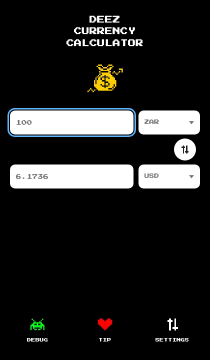

# Deez Currency Calculator


Fiat and crypto converter in a compact black pixel-art shell — no login, no backend, no tracking.


## Who it’s for

Anyone who wants a quick ZAR / USD / crypto check without opening a brokerage app or pasting into a website that wants an account. Runs as a **Tauri desktop window** or as a **PWA** in the browser. Rates come from Coinbase’s public endpoint; math uses exact decimals and a local cache when you’re offline.

## Quick start

**Requirements:** Node.js 20+, [pnpm](https://pnpm.io), [Rust/Cargo](https://rustup.rs) (first desktop build), Xcode Command Line Tools on macOS.

| Platform | Launcher |
|----------|----------|
| macOS | Double-click **`run.command`** |
| Windows | Double-click **`run.bat`** |

Installs deps, rebuilds the release app when needed, then opens the native window (**420×720**). No browser tab for normal use.

Optional Desktop shortcut: `./run.command --shortcut` / `run.bat --shortcut`. Force rebuild: `--rebuild`.

## Features

- Fiat + major crypto pairs with live Coinbase rates
- Exact decimal conversion; last-known rates cached locally
- Offline / stale rate labels when the network is down
- No analytics, ads, cookies, API keys, or account
- Same UI as desktop app or installable PWA

## Screenshots

<details>
<summary>More screenshots</summary>

| Converter (100 ZAR) | Tip screen |
|---------------------|------------|
|  |  |

</details>

## Limitations

- Coinbase rates are **indicative** — banks and exchanges may differ and add fees
- Catalogue is curated major currencies; availability follows what Coinbase returns
- Desktop shell is window-only (no native IPC beyond the web UI)

## Development

```text
pnpm install
pnpm tauri:dev          # desktop window (preferred)
pnpm dev                # browser Vite at http://127.0.0.1:5181
pnpm test && pnpm lint && pnpm format:check
pnpm build && pnpm tauri:build
pnpm test:e2e
```

Sticky Vite port **5181** (`strictPort`, `127.0.0.1`). Preview/e2e **4173**. Launch splash **5191**.

Project map: `src/api/`, `src/conversion/`, `src/storage/`, `src/main.ts`, `src-tauri/`, `tests/`.

## Credit

Created by [deac.online](https://deac.online) @ [worldbuild.io](https://worldbuild.io)

## License

MIT — see [LICENSE](LICENSE).
